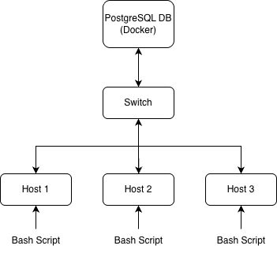

# Introduction
The Linux Cluster Monitoring Agent collects hardware and real-time resource usage data from Rocky Linux servers and stores it in PostgreSQL database. The system uses Bash scripts to gather CPU, memory, and disk metrics, with cron scheduling to automate periodic data collection.
PostgreSQL is provisioned via Docker, and Git manages the project?s codebase. Designed for multi-host clusters, each server runs the same lightweight agent, allowing the LCA team to monitor system health, compare node performance, and run analytical SQL queries for capacity planning and operational insights.

# Quick Start
Use markdown code block for your quick-start commands
- Start a psql instance using psql_docker.sh
- Create tables using ddl.sql
- Insert hardware specs data into the DB using host_info.sh
- Insert hardware usage data into the DB using host_usage.sh
- Crontab setup

``` bash
# Create PostgreSQL container
bash ./scripts/psql_docker.sh create db_user db_password
## Start the PostgreSQL container
bash ./scripts/psql_docker.sh start
## stop the running psql docker container
bash ./scripts/psql_docker.sh stop 

# Create tables
psql -h localhost -U postgres -d host_agent -f sql/ddl.sql

# Insert hardware specs
bash ./scripts/host_info.sh psql_host psql_port host_agent db_user db_password

# Insert usage data
bash ./scripts/host_usage.sh psql_host psql_port host_agent db_user db_password


# Setup cron job
crontab -e
# Run host_usage every minute
* * * * * bash /path/to/host_usage.sh psql_host psql_port host_agent db_user db_password
```

# Implementation
Discuss how you implement the project.
## Architecture
The monitoring architecture consists of multiple Linux hosts running monitoring agents. Each agent gathers system metrics and sends them to a PostgreSQL instance running inside Docker.



## Scripts
Shell script description and usage (use markdown code block for script usage)
### psql_docker.sh
Manages the PostgreSQL Docker container.
- Create a PostgreSQL container
- Start/stop the container
- Automatically initialize Docker if not running
**Usage**
```bash
# Create and start a new PostgreSQL container
bash ./scripts/psql_docker.sh create db_user db_password

# Start the existing PostgreSQL container
bash ./scripts/psql_docker.sh start

# Stop the running PostgreSQL container
bash ./scripts/psql_docker.sh stop
```

### host_info.sh
This script collects hardware information from the current host and inserts it into the host_info table in the PostgreSQL database.
**Usage**
```bash
bash ./scripts/host_info.sh psql_host psql_port db_name db_user db_password
```
### host_usage.sh
This script collects usage metrics from the current host and inserts them into the host_usage table. It is designed to be executed every minute via cron.
**Usage**
```bash
bash ./scripts/host_usage.sh psql_host psql_port db_name db_user db_password
```
### crontab
cron is used to schedule host_usage.sh so that usage metrics are collected and inserted into the database automatically every minute.
**Usage**
To edit the crontab for the current user:
```bash
crontab -e
```
Add the line to run 'host_usage.sh' every minute:
```bash
* * * * * bash /path/to/host_usage.sh psql_host psql_port host_agent db_user db_password
```

## Database Modeling
This project uses two relational tables: `host_info` and `host_usage`. The following tables describe the schema and purpose of each field.

### `host_info`
This table stores **hardware information** about each host machine.  


| Column Name       | Type      | 
|------------------ |-----------|
| id                | SERIAL    | 
| hostname          | VARCHAR   | 
| cpu_number        | INT2      | 
| cpu_architecture  | VARCHAR   | 
| cpu_model         | VARCHAR   | 
| cpu_mhz           | FLOAT8    |
| l2_cache          | INT4      | 
| timestamp         | TIMESTAMP | 
| total_mem         | INT4      | 
---

### `host_usage`

This table stores **usage metrics**, collected every minute via cron.  


| Column Name     | Type      | 
|-----------------|-----------|
| timestamp       | TIMESTAMP | 
| host_id         | SERIAL    | 
| memory_free     | INT4      | 
| cpu_idle        | INT2      | 
| cpu_kernel      | INT2      | 
| disk_io         | INT4      |
| disk_available  | INT4      | 
---

# Test

- **Docker Testing** -
- Ran `create`, `start`, and `stop` commands.
- Confirmed the container was created once and responded correctly to start/stop operations.

- **DDL Testing** -
- Confirmed both tables (`host_info`, `host_usage`) were created successfully.
```bash
psql -h localhost -U postgres -d host_agent -c "SELECT * FROM host_info LIMIT 5;"
psql -h localhost -U postgres -d host_agent -c "SELECT * FROM host_usage LIMIT 5;"
```
- **Cron Simulation** -
- Simulated cron by running the script repeatedly.
- Observed continuous and valid data insertion into `host_usage`.

# Deployment
The monitoring system was deployed using GitHub, Docker, and cron:
- **GitHub:**  
	The project repository was cloned onto the Linux host to run all scripts.

- **Docker (PostgreSQL):**  
  The PostgreSQL database was created and managed using the `psql_docker.sh` script.  

- **Database Setup:**  
  The `ddl.sql` file was executed using `psql` to create the `host_info` and `host_usage` tables.

- **Host info Registration:**  
  `host_info.sh` was to insert hardware information into the database.

- **Usage Metric Collection (cron):**  
  The `host_usage.sh` script was scheduled in `crontab` to run every minute, allowing continuous collection of CPU, memory, and disk metrics.
  
# Improvements
Several enhancements could be added to make the monitoring system more robust and feature-complete:

- **Handle hardware updates:**  
  Automatically detect when hardware information changes and update the `host_info` table accordingly instead of only inserting it at the beginning.

- **Improve error handling and logging:**  
  Add structured logs for script failures, or invalid metric values to make debugging easier.
  
- **Automate full setup with a single script:**  
  Create a master setup script that:
  - starts the PostgreSQL Docker container,  
  - runs `ddl.sql` to create tables,  
  - executes `host_info.sh` once, and  
  - installs the `host_usage.sh` cron job,  
